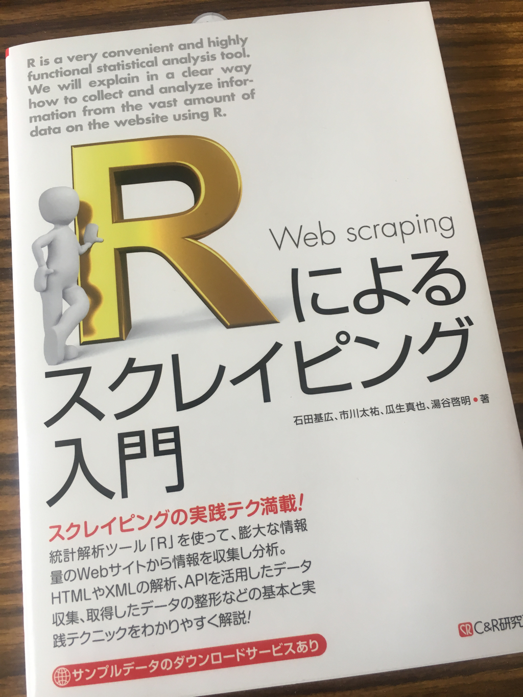
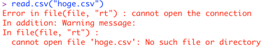
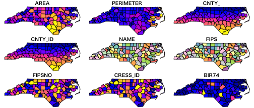

```{r setup, include = FALSE, purl = FALSE}
options(htmltools.dir.version = FALSE, servr.daemon = TRUE)
knitr::opts_chunk$set(cache = FALSE,
                      echo      = TRUE, 
                      tidy      = FALSE,
                      comment   = "#",
                      message   = FALSE, 
                      error     = FALSE, 
                      warning   = FALSE,
                      fig.align = "center")
library(remoji)
```

# `r emoji("scroll")` 概要

ハンズオンで利用するR, RStudioについて、紹介を兼ねたおさらいをします。

---
# `r emoji("bulb")` Rについて

.pull-left[

]

.pull-right[
- オープンソースのプログラミング言語
- パッケージ（ライブラリ）による機能拡張が充実
- (当初は) 学術・研究領域で活用される
    - 書籍がたくさん出ている
]

--
## データ分析を行う人の「`r emoji("hocho")` 道具 `r emoji("hammer")`」

<!-- そうむ, kubo lattice, RAPI -->

---


---
# `r emoji("large_blue_circle")` RStudio

- Rの統合開発環境 (IDE)
- Rと同じくマルチプラットフォーム (Windows, Mac, Ubuntuで動く)
- プロジェクト機能をはじめ、Rを実行する上で便利な機能が備わる

<!-- 各パネルの概要。レイアウト変更。 -->

<!-- 新規Rコードファイルの作成 -->

---
# `r emoji("large_blue_circle")` RStudioの画面


---
# Rproject

- Rを実行する作業環境(ワーキングディレクトリ)
    - コードやデータ、プロットした図のデフォルトの保存先
- プロジェクトに応じて切り替えると良い

<!-- 左上のアイコンから切り替え -->

--



こうした過ちを防ぎやすい...

--
## 新規プロジェクトの作成

メニューバーのFileから...

---
class: bg-hlt, middle, center
# `r emoji("+1")` やってみよう `r emoji("muscle")`

ダウンロードしたフォルダにある<br>**170630_handson.Rproj**<br>をRStudioで開きます

---
# `r emoji("beginner")` 最初の3行のRコード

たったの3行で地図が描ける

```{r 最初の3行のRコード}
library(sf)
nc <- read_sf(system.file("shape/nc.shp", package = "sf"))
```

```{r fig_1_sf_nc, eval = FALSE, fig.height = 3, echo = TRUE}
plot(nc)
```

<!-- North Carolina -->



```{r, eval = FALSE, echo = FALSE}
plot(nc["NAME"])
```

---
class: bg-hlt, middle, center

# 超簡単

---
## `r emoji("beginner")` 最初の3行のRコード (おさらい)

1. **sf**というパッケージを利用可能にする
2. `read_sf()`関数によりshapefileを読み込み、"nc"という名前のオブジェクトに保存する
3. "nc"を`plot()`関数で描画する

```{r fig_1_sf_nc, eval = FALSE, fig.height = 3, echo = TRUE}
library(sf)
nc <- read_sf(system.file("shape/nc.shp", package = "sf"))
plot(nc)
```

---
# `r emoji("bookmark")` Rを扱う上で重要なことば

- オブジェクト、クラス
- 関数、引数、演算子
- パッケージ

---

# オブジェクト

### Rで操作する文字、値、関数、変数、データ... <br>Rで扱う「**もの**」の全て

- 「もの」なのなので名前をつけられる
-  `<-` は代入演算子
    - `res <- 1+1; res`
    - resに結果を保存。resとして結果を呼び出す
    - `res + 3`
- オブジェクトの種類に応じて名前が付いている
   - クラス

<!-- RStudioのEnvironmentたぶ -->

---
# オブジェクトのクラス

オブジェクト名で内容が出力される

```{r オブジェクトのクラス, eval = FALSE}
letters # 文字列ベクトル
# [1] "a" "b" "c" "d" "e" "f" "g" ...

iris # データフレーム
#     Sepal.Length Sepal.Width Petal.Length Petal.Width    Species
# 1            5.1         3.5          1.4         0.2     setosa
# 2            4.9         3.0          1.4         0.2     setosa
# 3            4.7         3.2          1.3         0.2     setosa
# ...

help # 関数
# function (topic, package = NULL, lib.loc = NULL, verbose = getOption("verbose"), ...
```

オブジェクトがどのクラスに属するかを`class()`を使って確認

---
# データフレーム

.pull-left[
エクセルなどの**行、列**をもった表形式のデータ格納方法

```{r データフレーム}
class(iris)
class(nc)
```
]

.pull-right[

]

--
## データフレームにしておくと関数が適用しやすい

---
# データフレーム

（行・）列には名前がつく

```{r データフレーム}
names(iris) # オブジェクトに与えられている名前を取得
```

```{r}
head(iris, n = 2) # 先頭行を返す関数
dim(iris) # データフレームのサイズ（行数と列数）を確認
```

---
# データフレーム

データフレームの値の参照: `[`, `$`, (`[[`)

```{r データフレーム}
# [演算子を使ってデータフレームの各値を参照
iris[2, ] # 2行目
iris[1:4, "Sepal.Length"] # Sepal.Length列の1から4番目の値
# $演算子
iris$Species[1]
```

---
# 関数・演算子

### Rで色々な処理を実行する役割をもつ

- `関数名(引数){処理内容本体}`という形
    - ユーザが触れるのは関数名と引数
    - 引数は、関数を実行する対象や、関数の挙動を制御するための値を指定する
- `1 + 1`を実行するための `+` も関数の一種（演算子）
- `function()`により定義される（自作関数を書ける）

<!-- 引数...さっきやったhead(n=)とか、グラフのパラメータとか -->

--
## 関数を覚えることでRでできることの幅が広がる

---
class: bg-hlt, middle, center
# `r emoji("tophat")`

<!-- マジックの帽子... 何をするかは決まっている。入れるものに応じて結果が変わる -->

---
# `r emo::ji("think")` 関数への理解を深めるには

### `help(関数名)`

<!-- RStudioのhelp -->

- Description
- Arguments
- Usage
- Examples
- ...

---
# `r emoji("package")` パッケージ

### トピックごとに関数をまとめて提供

- インストール時から利用可能
- `library()`を使って呼び出す
    - ex) `library(sf)`
    - `package::function()`という形式でも良い
- CRAN (しーらん、くらん) からインストール
    - インストールされていないパッケージを読み込むとエラー。
    - 現在多くのパッケージがGitHubで開発されています。

<!-- ミラーはRStudioで設定。RStudioのクラウドがおすすめ -->

---
class: bg-hlt, middle, center
# それでは改めて

---
# `r emoji("beginner")` 最初の3行のRコード

```{r 最初の3行のRコード, eval = FALSE, echo = TRUE}
# 依存関係にあるパッケージもダウンロード
# install.packages("sf", dependencies = TRUE)
```

```{r fig_1_sf_nc, eval = FALSE, fig.height = 3, echo = TRUE}
library(sf)
nc <- read_sf(system.file("shape/nc.shp", package = "sf"))
plot(nc)
```


