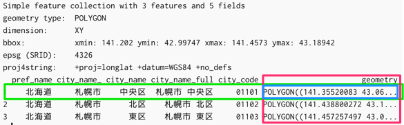

```{r setup, include = FALSE, purl = FALSE}
options(htmltools.dir.version = FALSE)
knitr::opts_chunk$set(cache = FALSE,
                      echo      = TRUE, 
                      tidy      = FALSE,
                      comment   = "#",
                      message   = FALSE, 
                      error     = FALSE, 
                      warning   = FALSE,
                      fig.align = "center")
library(remoji)
library(widgetframe)
```


# `r emoji("scroll")` 概要

パッケージを利用したデータ操作と可視化の方法を学びます。はじめに、用意したデータで簡単な説明をします。その後、北海道のオープンデータを用いて、応用的な処理を実践します。

---
# `r emoji("bulb")` パッケージを呼び出そう

```{r パッケージを呼び出そう}
# library(tidyverse)
library(dplyr) # データ操作一般
library(sf) # 地理空間情報データ処理
library(leaflet) # 地図描画
```

ここでは主要なパッケージだけを呼び出します。

--

`r emoji("bookmark")` 名前空間を利用した関数の利用

```{r, eval = FALSE, echo = TRUE}
package::function(...)
readr::read_csv("hoge.csv")
```

---
# `r emoji("package")` dplyrパッケージ

### データ操作を行う上での重要な機能を関数として提供

<https://github.com/tidyverse/dplyr>

.pull-left[
- データに対する主要な操作
    - 選択
    - 抽出
    - 加工
    - 集計
    - ...
- データベースからのデータ取得
]

.pull-right[

]

---
# `r emoji("package")` sfパッケージ

### モダンな手法で多様な地理空間データを扱う

<https://github.com/edzer/sfr>

<!-- 参加者にとってはここが大事 -->

<!-- 比較的シンプル！、gisドメインがなくても良いという利点 -->


- Simple Featuresをはじめとした多様なデータソースに対応
    - shapefile
    - kml, geojson, WKT/WKB
    - PostgreSQL
- **dplyr**と同名の関数による地理空間データの操作
- PostGISの関数に近い空間操作・解析が可能

---
# `r emoji("package")` leafletパッケージ

### インタラクティブな地図操作が可能

<https://github.com/rstudio/leaflet>

.pull-left[
- JavaScriptで書かれたオープンソースのライブラリ
- アプリケーション内で活躍
- プラグインによる拡張が可能
    - **[leaflet.extra](https://github.com/bhaskarvk/leaflet.extras)**
    - **[leaflet.esri](https://github.com/bhaskarvk/leaflet.esri)**
    - **[leaflet.minicharts](https://github.com/rte-antares-rpackage/leaflet.minicharts)**
]

.pull-right[
```{r インタラクティブな地図操作が可能, echo = FALSE, out.width = '80%', fig.height = 4.6, eval = require('leaflet')}
leaflet() %>% addTiles() %>% 
  setView(lng = 141.348, lat = 43.066, zoom = 17) %>% 
  addPopups(lng = 141.348, lat = 43.066,
            popup = "Hi!",
            options = popupOptions(closeButton = FALSE))
```
]


---
# データの用意

- 平成27年国勢調査 人口等基本集計 総務省統計局 <http://www.stat.go.jp/data/kokusei/2015/>

```{r, echo = FALSE, purl = FALSE}
df.pops <- readr::read_rds("../inst/data/pref01_population2015.rds")
df.pref01 <- read_sf("../inst/data/ksj_n0301.shp",
                     stringsAsFactors = TRUE) %>% 
  magrittr::set_names(c("pref_name", "city_name_", "city_name", "city_name_full", "city_code", "geometry"))
```

```{r データの用意, eval = FALSE, echo = TRUE}
df.pops <- readr::read_rds("inst/data/pref01_population2015.rds")
```

```{r}
class(df.pops)
glimpse(df.pops) # dplyrのデータ出力関数
```

---
# データの用意

- 国土数値情報 行政区域データ (北海道) <http://nlftp.mlit.go.jp/ksj/gml/datalist/KsjTmplt-N03.html>

```{r データの用意, eval = FALSE, echo = TRUE}
df.pref01 <- read_sf("inst/data/ksj_n0301.shp") %>% 
  magrittr::set_names(c("pref_name", "city_name_", "city_name", "city_name_full", "city_code", "geometry"))
```

```{r}
class(df.pref01)
```

---
# sfオブジェクト

.pull-left[
- Simple feature collection
    - 5変数 + geometry
- 地物タイプ: ポリゴン
- 次元: XY
- 範囲
- 空間参照システム(epsg)
- 投影法
]

.pull-right[
```{r sfオブジェクト, eval = FALSE, echo = TRUE}
head(df.pref01, 3)
```

]

---
# 描画してみる

```{r fig_2_plot_hkd_all, fig.height = 3.0, dpi = 300}
plot(df.pref01)
```

---
# 描画してみる

.pull-left[
```{r fig_2_plot_hkd_city_code, fig.height = 5, dpi = 300}
plot(df.pref01["city_code"])
```
]

--
.pull-right[
```{r, eval = FALSE, echo = TRUE}
# 結果は同じ
df.pref01 %>% 
  select(city_code) %>% 
  plot()
```

```{r, eval = FALSE, echo = TRUE}
plot(st_geometry(df.pref01))
```
]


---
# select()による変数の選択

.pull-left[
```{r select()による変数の選択}
# 変数名を引数で指定する
df.mod <- df.pref01 %>% select(city_name_full)
names(df.mod)
```
]

--

.pull-right[
```{r fig_2_plot_hkd_select, fig.height = 5, dpi = 300}
plot(df.mod)
```
]

---
# filter()によるデータ抽出

.pull-left[
```{r filter()によるデータ抽出}
# 条件に従うデータを抽出する
df.mod <- df.mod %>% 
  # 「札幌市」を含んだ行を取り出す
  filter(grepl("札幌市", city_name_full))
```
]

.pull-right[
```{r fig_2_plot_hkd_filter, fig.height = 5, dpi = 300}
plot(df.mod, 
     col = "gray", 
     axes = TRUE)
```
]

---
# mutate()によるデータの加工

```{r mutate()によるデータの加工}
df.pref01$city_code[1] %>% class()
# 文字列型に変換
df.pref01$city_code[1] %>% as.character() %>% 
  class()
```

```{r}
# データフレームの列に適用
df.mod <- df.pref01 %>% 
  mutate(city_code = as.character(city_code))

df.mod$city_code[1] %>% class()
```

---
# 人口データと結合

2つのデータフレーム間で共通する変数を紐付ける

.pull-left[
```{r 人口データと結合}
df.mod <- df.mod %>% 
  left_join(df.pops, by = "city_code")

# 結合時の変数名とデータ型に注意
# df %>% 
#   left_join(df.pops, by = "city_code")
# # Warning message:
# # Column `city_code` joining factor and character vector, coercing into character vector 
```
]

.pull-right[
```{r fig_2_plot_hkd_population, fig.height = 5, dpi = 300}
plot(df.mod["value"], 
     col = colormap::colormap("viridis"))
```
]

---
class: bg-hlt, middle, center
# `r emoji("+1")` やってみよう `r emoji("muscle")`

<!-- 5分くらい時間を取ってあれこれやってもらう -->

---
# sfパッケージによるジオメトリ操作
  
- st_union: ジオメトリの結合
- st_buffer: 緩衝帯の付与
- st_centroid: 重心点を求める
- st_voronoi: ボロノイ領域の作成
- st_contains, st_overlaps, st_within: 地物の関係
- ...
  
```{r sfパッケージによるジオメトリ操作, eval = FALSE, echo = TRUE}
st_union(df.pref01) %>% 
  plot()

df.pref01["city_code"] %>% 
  st_buffer(dist = 0.05) %>% 
  plot()

st_centroid(df.pref01["city_code"]) %>% 
  plot()
```

---
# leaflet

```{r leaflet, eval = TRUE, echo = TRUE}
base.map <- leaflet() %>% 
  addTiles()
```

--
- はじめに`leaflet()`を使って、必要な要素を足していく
- `addTiles()`はOpenStreetMapのタイルを呼び出す関数
    - `addProviderTiles()`の引数に`names(providers)`で表示されるサードパーティタイルを変更
    - `addTiles()`任意のタイルを利用。
        - 国土地理院タイルを利用する方法 <http://rpubs.com/yutannihilation/121912>

---
# leafletにsfオブジェクトを描画させる

```{r leafletにsfオブジェクトを描画させる, eval = FALSE, echo = TRUE}
base.map %>% 
  addPolygons(data = df.pref01)
```

```{r, eval = TRUE, echo = FALSE, purl = FALSE}
l <- base.map %>% 
  addPolygons(data = df.pref01)
frameWidget(l, width='100%')
```

---
# leafletにsfオブジェクトを描画させる

.pull-left[
```{r}
df.mod <- df.pref01 %>% 
  filter(city_name_ == "札幌市")
```

```{r, eval = FALSE, echo = TRUE}
base.map %>% 
  addPolygons(data = df.mod) %>% 
  addMarkers(data = st_centroid(df.mod),
             popup = ~city_name)
```
]

.pull-right[
```{r, eval = TRUE, echo = FALSE, purl = FALSE}
l2 <- base.map %>% 
  addPolygons(data = df.mod) %>% 
  addMarkers(data = st_centroid(df.mod),
             popup = ~city_name)
frameWidget(l2)
```
]

---
class: bg-hlt, middle, center
# オープンデータを利用しよう

---
# 北海道オープンデータカタログ

<http://www.pref.hokkaido.lg.jp/ss/jsk/opendata/opendata.htm>

- 北海道はオープンデータが多い
- 北海道オープンデータカタログでは、基本的に**Creative Commonsの表示（CC BY）**に従うことで二次利用可能

---
# どのデータを使う?

- ウェブスクレイピングにより一覧を確認
     - スクレイピング... ウェブページ上のテキストやデータを取得
     
```{r どのデータを使う?}
library(rvest)
```

```{r, eval = FALSE, echo = TRUE}
x <- read_html("http://www.pref.hokkaido.lg.jp/ss/jsk/opendata/opendata.htm")
df.opd <- x %>% html_table(fill = TRUE) %>% 
  .[[3]]
```

```{r, include = FALSE}
df.opd <- readr::read_rds("../inst/data/hkd_opendata_catalog.rds")
```

```{r, eval = FALSE, echo = TRUE}
df.opd %>% View()
```

---
# 詳細な要素（リンク先のURL）を取得

```{r 詳細な要素（リンク先のURL）を取得, eval = FALSE, echo = TRUE}
x %>% html_nodes(css = '#rs_contents > p:nth-child(4) > span > strong')
# {xml_nodeset (1)}
# [1] <strong>北海道オープンデータカタログ</strong>
```

--
```{r, eval = FALSE, echo = TRUE}
x %>% html_nodes(css = '#rs_contents > p:nth-child(4) > span > strong') %>% 
  html_text()
# 北海道オープンデータカタログ
```

```{r, eval = FALSE, echo = TRUE}
x %>% html_nodes(css = '#open_data > tbody > tr:nth-child(222) > td:nth-child(3) > a') %>% 
  html_text()
# [1] "森林計画関係資料（GIS用データ）"
(link.url <- x %>% html_nodes(css = '#open_data > tbody > tr:nth-child(222) > td:nth-child(3) > a') %>% 
  html_attr(name = "href"))
# [1] "http://www.pref.hokkaido.lg.jp/sr/srk/OPD.htm"
```

ブラウザの開発モードを使ってselector、XPathを取得すると楽

---
# 森林計画関係資料のダウンロード

```{r 森林計画関係資料のダウンロード, eval = FALSE, echo = TRUE}
x <- read_html(link.url)

x %>% html_nodes(css= '#rs_contents > div > table > tbody > tr > td:nth-child(2) > p:nth-child(1) > a:nth-child(9)') %>%
  html_text()
# [1] "留萌 " "留萌" 

x %>% html_nodes(css= '#rs_contents > div > table > tbody > tr > td:nth-child(2) > p:nth-child(1) > a:nth-child(9)') %>%
  html_attr("href")
# [1] "https://www.fics.pref.hokkaido.lg.jp/FILE/2015/KMZ/09rumoi.zip"
# [2] "https://www.fics.pref.hokkaido.lg.jp/FILE/2015/GIS/09rumoi.zip"
```

```{r, eval = FALSE, echo = TRUE}
download.file("https://www.fics.pref.hokkaido.lg.jp/FILE/2015/GIS/09rumoi.zip",
              destfile = "inst/09rumoi.zip")
unzip(
  'inst/09rumoi.zip',
  exdir = "inst/"
)
```

---
class: bg-hlt, middle, center
# `r emoji("+1")` やってみよう `r emoji("muscle")`
